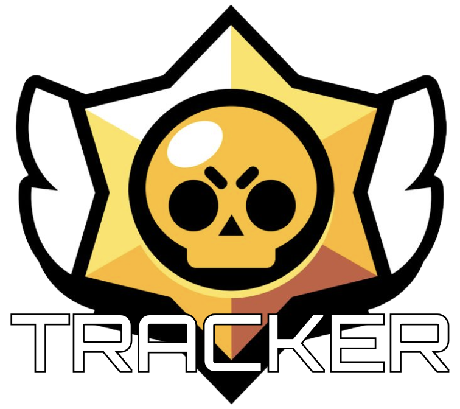

# BSTracker

## CSC207 Project Group 186 - GriesGaming

## Members:
Wilson Chen - wchen27

Thomas Lascaud - thigamore

Justin Du - dujstn

Harry Peng - harrypenguin

Lawrence Bae - mgbae-uoft

## Overview

Brawl Stars is a mobile game where each user plays a specific character (brawler) and tries to beat their opponents in various game modes in individual matches to gain additional trophies. These matches range from solo game modes to 5v5. Each player’s brawler is able to deal damage to enemy brawlers and score takedowns and assists to help further their team’s progress towards an objective decided by the game mode. The game measures the player’s skill through trophies, where each win will grant the player trophies and each loss will deduct trophies. The player’s brawlers each have their own individual trophy count, as well as a total trophy count for all the brawlers that the player owns. At the end of each match, the player who the game deems the most impactful towards the objective is awarded the title of “Star Player,” with additional titles being granted to the player with the most damage and the most healing. 

This application provides the user with statistics of their recent performance, as well as letting them see the recent performances of other players. These statistics include which brawlers they play, how many games they have played total/with each brawler/on each map, how many trophies they have in total and how many trophies each individual brawler they own has, and their win/lose rate overall, on each map, and on each brawler. 
Additionally, this app calculates a “performance score” between 1-100 for each user for each individual game, assessing the impact that player had during that game. Finally, this application lets the user review the statistics of past matches that are available and see which brawler they were playing, if they won, their opponents/teammates, and their overall performance score during that game. 

## User Stories
### Team Story: 
Grom wants to be able to search different users to be able to see some basic information about them such as win/loss statistics, top brawlers played, and recent matches.
Use Case 1: Input – playerTag (string). Output – playerInfo (hashMap)

### Wilson: 
As a competitive Brawl Stars Player, I want to view my aggregate performance in recent games to see if I am playing better or worse than in the past. 

### Justin: 
As a player who would like to gain trophies as efficiently as possible, I want to
retrieve a list of the most popular brawlers played in recent games to be able to know which of the brawlers are strong.

### Thomas:
As a player who wants to effectively gain trophies, I want to view relevant statistics (average damage, knockouts, etc. per game) and compare it with my performance to see if I am performing up to par with other players on the same brawler.

### Zehao: 
As a new Brawl Stars player, I want to rank my friends’ performance to understand how they play and who is a good player.

### Lawrence:
As a competitive Brawl Stars player, I want to analyze my gameplay and compare it with top players, so I can understand my strengths and weaknesses across different brawlers, maps, and game modes. I also want insights into the performance of my friends and teammates to evaluate if our playstyles align or if adjustments are needed to improve our synergy. Lastly, I want to track my own skill progression over time to see my improvement in various game metrics, such as damage dealt, knockouts, and win rates, which will help me make strategic decisions on which brawlers and strategies to focus on.

